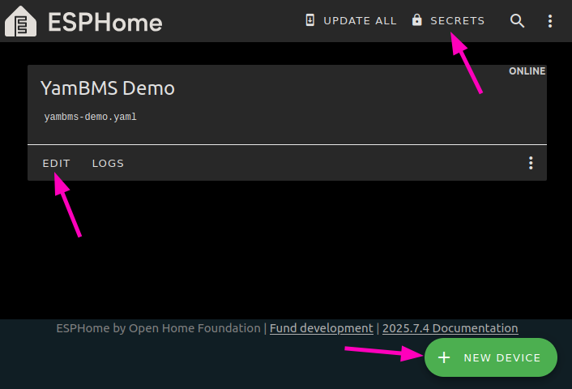

# YamBMS - Installation procedure

[](https://www.gnu.org/licenses/gpl-3.0)
[](https://github.com/Sleeper85/esphome-yambms/releases/latest)


## Make your YAML

> [!TIP]
> Not sure which YAML to choose ? ... [YamBMS_Remote_Packages_example.yaml](../../YamBMS_Remote_Packages_example.yaml)
> is a good basis for creating your custom YAML.
> Examples of `BMS` and `Shunt` packages can be found in the [examples](../../examples/single-node/) folder.
> You don't have to import a shunt but you must import at least `one BMS`.
> You can mix different `BMS` models, the only condition is that the `bms_id` are numbered in order starting from `1` !

* [YamBMS LP (Local Packages) HowTo](YamBMS_LP_YAML.md)
* [YamBMS RP (Remote Packages) HowTo](YamBMS_RP_YAML.md)

## Installation from the `ESPHome Builder` add-on of your `Home Assistant` server

> [!TIP]
> This method is the easiest for beginners.

**Prerequisites:** install the `ESPHome Builder` add-on in your `Home Assistant` server.



### 1. Enter your WiFi credentials in the `SECRETS` YAML in the top right corner

```YAML
wifi_ssid: YourSSID
wifi_password: YourPassword
domain : .local
```

### 2. Add your `ESP32` by clicking on `+ NEW DEVICE` at the bottom right

Follow the procedure displayed on the screen.

### 3. `EDIT` your newly added ESP32 and copy your `YamBMS RP` YAML

> [!IMPORTANT]
> If your ESP32 already contains `API` or `OTA` keys, don't forget to add them to your YAML.

### 4. Install your YAML `Wirelessly` or via `USB` port

Follow the procedure displayed on the screen.

### 5. Optional but recommended, add the ESP32 in your `Home Assistant` server

In Home Assistant under **" Settings > Devices and services > Add Intergration "** select ESPHome add device `yambms` if found or supply ip address of ESP32.

## Installation from a Windows, Mac or Linux computer

### 1. Install ESPHome on your computer

Before you can flash your ESP32 you need to install the [ESPHome 2025.6.0 or higher](https://github.com/esphome/esphome/releases) command line application.<br>
[Follow these instructions for installation on Windows, Mac or Linux.](https://esphome.io/guides/installing_esphome)

> [!TIP]
> If you are using Windows install the `setuptools` package in addition to `wheel` and `esphome`.

```bash
pip3 install setuptools
pip3 install wheel
pip3 install esphome
```

### 2. Download all YAML files to your computer

> [!TIP]
> The `packages` folder is not necessary if you are compiling the `Remote Packages` version of the YAML.

You can do this from the command line or in your preferred method.

You need to gather the following three points in the same folder. If you are compiling from your HA server use the `Samba Share` add-on so that you can copy the `packages` folder to the `esphome` folder on the HA server.

  1) the `packages` folder (not necessary with `RP` YAMLs)
  2) your `secrets.yaml`
  3) your custom `main.yaml`

```bash
# Clone this external component
git clone https://github.com/Sleeper85/esphome-yambms.git
cd esphome-yambms
```

### 3. Enter your WiFi credentials in the `secrets.yaml` files

```yaml
wifi_ssid: YourSSID
wifi_password: YourPassword
domain : .local
```

### 4. Install the `YamBMS.yaml` into your ESP32

```bash
# install your YamBMS.yaml
# validate the configuration, create a binary, upload it, and start logs.
esphome run YamBMS.yaml

# upgrade via OTA by specifying the IP address of the ESP32
esphome run YamBMS.yaml --device 192.168.x.x
```

### 5. Optional but recommended, add the ESP32 in your `Home Assistant` server

In Home Assistant under **" Settings > Devices and services > Add Intergration "** select ESPHome add device `yambms` if found or supply ip address of ESP32.

## Other ESPHome command-line

```bash
# clean files before compiling again
esphome clean YamBMS.yaml

# test the config
esphome config YamBMS.yaml

# install the config in ESP32
esphome run YamBMS.yaml

# compile the firmware.bin
esphome compile YamBMS.yaml

# check the logs (the --device option is not required)
esphome logs YamBMS.yaml --device 192.168.x.x
```

## Debugging

If this component doesn't work out of the box for your device please update your configuration to increase the log level to `DEBUG`.

```YAML
logger:
  level: DEBUG
```
